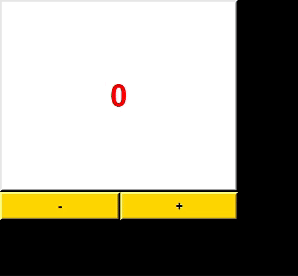

# 🎰 Counter_App 

Feeling the need for a little more excitement in your life? Look no further than this vibrant Counter App! Built with Python and Tkinter, this app not only keeps track of your counts but also adds a splash of color to your day. **The fun is the counter's background color changes randomly when incremented, while the text color changes randomly when decremented.**

## 🛠️ Main Technologies

- `Python 3.x`
  - `random`
  - `tkinter`

## 🚦 Running the Project

To run the project in your local environment,Python must be installed on your system and follow these steps:

1. Clone the repository to your local machine or just copy-paste the code in `counter.py`
2. Run `pip install tkinter` in the project directory to install the Tkinter library, which is usually included with Python installations.
3. Run `py counter.py` in terminal or click on run `▶️` button to get the project started.

## 🦄 Features

- **⛓️ Increment and Decrement:** Easily increase or decrease your count with the click of a button.
- **🖼️ Colorful Display:** The background and text colors change dynamically, adding a touch of flair to your counting experience.
- **💎 Customizable:** You can even add more colors to personalize your counting journey.

## 🤷 How to Use

1. **➡️ Increment:** Click the "+" button to increase the count.
2. **⬅️ Decrement:** Click the "-" button to decrease the count (if the count is greater than zero).
3. **🔲 Colorful Display:** Watch as the background color changes with each click, keeping your counting experience fresh and exciting.

## 👩🏽‍🍳 Process 🍳

I just created a counter app. Counting has never been this fun! Whether you're keeping track of tasks, drinks, or anything else, this app adds a playful twist to the mundane.

If you are feeling adventurous? Add more colors to the `colors` list in the code to expand your color palette and make your Counter App truly unique!

Feel free to customize and extend this counter app based on your requirements!

## 🐛 Current Bug

So far, I'm not really sure if there are any bugs. However, there might be some issues. I tested it out on my computer (Windows 10), and so far it looks good there.

## 🚀 Let's Get Started

Ready to add some zest to your counting routine? [Download Counter App now!](https://github.com/malik-l0l/Counter_App/raw/main/executable/Counter_App.exe) It's the perfect blend of functionality and fun.

## 🍿 Preview

